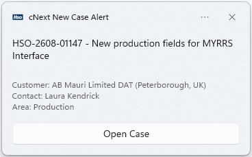
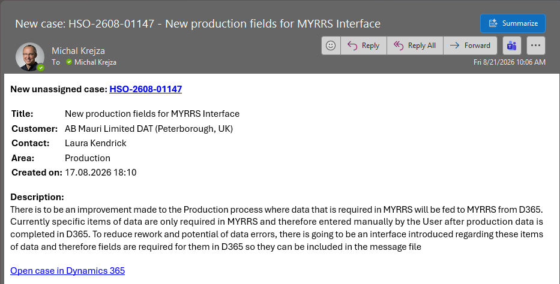

# CNext Case Notification

A lightweight Windows notifier that polls a **Dynamics 365 Customer Engagement** view for new
unassigned cases and alerts you the moment one appears — with a native **Windows toast** and an
optional **Outlook email**.

It runs quietly in the background on a schedule, so you never have to keep the "Unassigned Cases"
view open to catch new work.

<p align="center">
  
  &nbsp;&nbsp;
  
</p>

---

## Features

- **Toast + email alerts** for every new case, containing the case code, title, customer, contact,
  area, description, and a one-click link to open the record in D365.
- **No app registration required.** Authenticates as *you* using Microsoft's pre-consented public
  Dataverse client, so there's nothing to register in your tenant. Sign-in happens once and is
  cached on disk.
- **Uses the view's own FetchXML.** Results always match exactly what you'd see opening the view in
  D365 — edit the view later and the notifier stays in sync automatically.
- **Email needs no stored credentials.** Sent through the local Outlook desktop app (COM
  automation); the recipient (you) is auto-detected from the mailbox signed in on the PC.
- **Per-user Area filter.** Alert on all cases, or narrow to specific case Areas (e.g. `Finance`,
  `Sales`).
- **Zero-touch install.** One installer sets everything up: copies files, installs the required
  module, and registers a Task Scheduler job that polls every 10 minutes, 08:00–17:00, Mon–Fri.
- **Silent operation.** Runs with no visible console window.

---

## Requirements

- Windows 10 / 11 with Windows PowerShell 5.1
- Access to a Dynamics 365 CE organization
- Outlook desktop app (installed and signed in) — only if you want email alerts
- Internet access to install the [`MSAL.PS`](https://www.powershellgallery.com/packages/MSAL.PS)
  module (the installer handles this automatically)

---

## Installation

1. Download or clone this repository to a local folder.
2. Edit **`CNextCaseNotificationConfig.json`** with your settings (see below).
3. Run the installer — either:
   - Double-click **`CNextCaseNotificationInstall.bat`**, or
   - Right-click **`CNextCaseNotificationInstall.ps1`** → *Run with PowerShell*, or
   - From a PowerShell prompt:
     ```powershell
     powershell -ExecutionPolicy Bypass -File .\CNextCaseNotificationInstall.ps1
     ```

The installer:

1. Creates `C:\Scripts\CaseNotification` and copies the required files there.
2. Installs the `MSAL.PS` module if it isn't already present.
3. Registers the **"CNext Case Notification"** scheduled task (every 10 min, 08:00–17:00, Mon–Fri).
4. Runs the notifier once so you complete the one-time Dynamics sign-in while you're present.

On first run you'll be prompted to sign in to Dynamics (once), and Outlook may show an
*"A program is trying to send an email"* prompt — click **Allow**.

The installer is safe to re-run: it cleanly removes any previous version first and **preserves your
`CNextCaseNotificationConfig.json`** across the upgrade.

---

## Configuration

All user-editable settings live in **`CNextCaseNotificationConfig.json`** — you never need to touch
the script.

```json
{
  "orgUrl": "https://yourorg.crm4.dynamics.com",
  "viewId": "1a15c416-6670-eb11-a812-000d3adafcf9",
  "sendEmail": true,
  "notifyEmailOverride": "",
  "areaFilter": []
}
```

| Setting | Description |
| --- | --- |
| `orgUrl` | Your Dynamics 365 organization URL. |
| `viewId` | GUID of the personal view to poll — the value after `viewid=` in the view's URL. |
| `sendEmail` | `true` to also send an Outlook email; `false` for toast-only. |
| `notifyEmailOverride` | Leave `""` to alert your own mailbox (auto-detected). Set an address to redirect alerts elsewhere, e.g. a shared mailbox. |
| `areaFilter` | List of case Area names to alert on (case-insensitive), e.g. `["Finance", "Sales"]`. Leave `[]` to alert on **all** areas. |

> The values shipped in the config file are examples. Replace `orgUrl` and `viewId` with your own.

---

## How it works

Each run the script:

1. Authenticates to Dataverse as the current user (token cached on disk after the first sign-in).
2. Fetches the target view's FetchXML and runs it against the `incidents` entity.
3. Optionally filters the results by the configured case Areas.
4. Diffs the current cases against a local `CNextCaseNotificationSeen.json` to find **new** ones.
5. For each new case, shows a Windows toast and (optionally) sends an Outlook email.
6. Records the full current set as "seen" so nothing alerts twice.

---

## Files

| File | Purpose |
| --- | --- |
| `CNextCaseNotification.ps1` | The poller — fetches cases and fires notifications. |
| `CNextCaseNotificationConfig.json` | Per-user settings (org URL, view, email, area filter). |
| `CNextCaseNotificationInstall.ps1` | Installer — copies files and registers the scheduled task. |
| `CNextCaseNotificationInstall.bat` | Double-click launcher for the installer. |
| `CNextCaseNotificationRun.vbs` | Launches the poller with no visible window (regenerated on install). |
| `CNextCaseNotificationIcon.ico` | Toast header badge icon. |
| `CNextCaseNotificationDocs.html` | Installation & configuration guide. |
| `CNextCaseNotificationToast.png` / `CNextCaseNotificationEmail.png` | Screenshots used in the docs. |

---

## Uninstall

Remove the scheduled task and the install folder:

```powershell
Unregister-ScheduledTask -TaskName "CNext Case Notification" -Confirm:$false
Remove-Item -Path "C:\Scripts\CaseNotification" -Recurse -Force
```

---

## Notes & privacy

- No credentials, secrets, or passwords are stored by this tool. Authentication uses a cached OAuth
  token; email uses your already-signed-in Outlook profile.
- The `clientId` in the script is Microsoft's public, pre-consented Dataverse client — it is not a
  secret and requires no app registration in your tenant.

---

## License

Released under the [MIT License](LICENSE).
